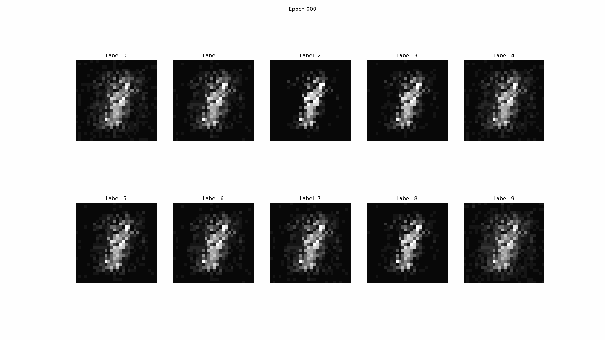

# Conditional GAN

Original paper: [Conditional Generative Adversarial Nets](https://arxiv.org/abs/1411.1784)

Here, the objective function of thw two-player minimax game is:

$$
V(D, G) = \mathbb{E}_{x \sim p_{\text{data}}}[\log D(x|y)] + \mathbb{E}_{z \sim p_z}[\log (1 - D(G(z|y)))]
$$

## Results
This is the evolution of samples generated from a fixed noise vector after each epoch.

